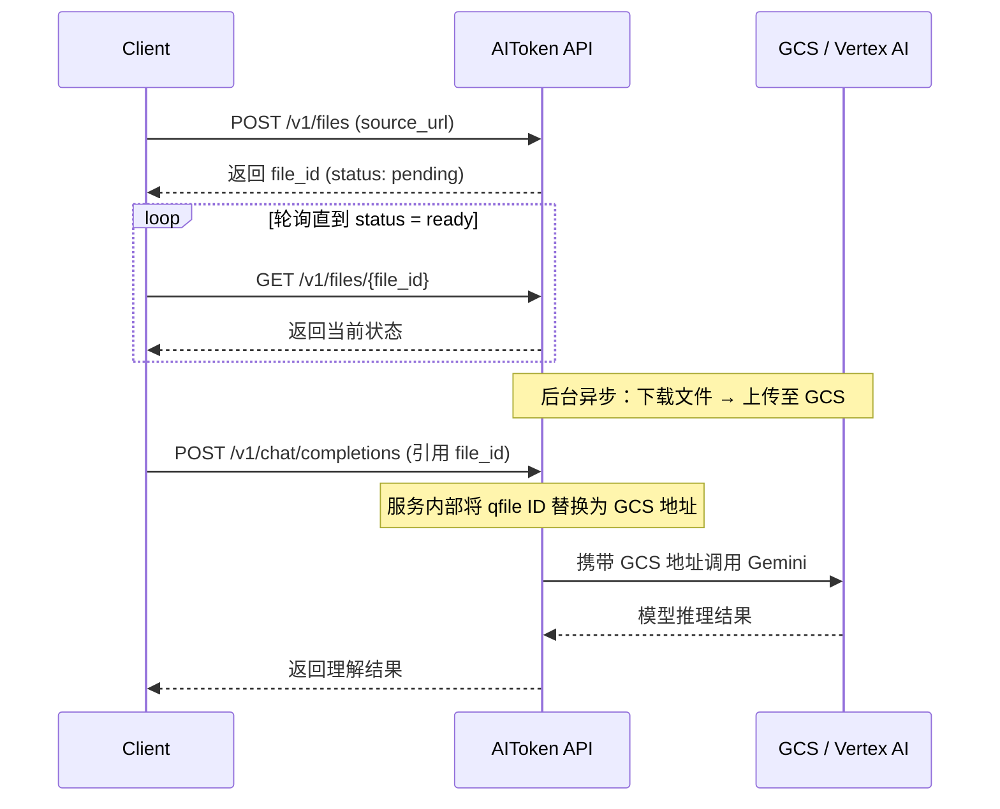

# Gemini 大文件理解示例（Go）

使用 [openai-go](https://github.com/openai/openai-go) SDK 和七牛 AIToken API，演示 Gemini 模型的大文件多模态理解能力。

## 背景

Vertex AI 通过 HTTP 直接传入文件进行理解时，存在 **15MB** 的硬性限制。对于大于 15MB 的文件（如长视频、高分辨率图像），官方要求必须使用 Google Cloud Storage (GCS) 链接。

七牛 AIToken 的 **文件上传接口**（`POST /v1/files`）简化了该流程：您只需提供文件的公开 URL，系统将自动把文件转存至 GCS 并对接 Vertex AI，无需自行配置或管理 GCS 存储桶。

### 接口约束

- **支持场景**：仅适用于 Gemini 模型的大文件（>15MB）多模态理解
- **文件大小**：最大支持 2GB
- **网络要求**：`source_url` 必须是公网可访问的 HTTP/HTTPS 地址

## 调用流程



### 文件状态说明

| 状态 | 说明 |
|------|------|
| `pending` | 等待处理 |
| `uploading` | 正在上传到目标存储 |
| `ready` | 上传完成，可用于推理 |
| `failed` | 上传失败，查看 `error` 字段获取详细信息 |
| `expired` | 文件已过期，需要重新创建 |

## 示例内容

本示例包含两个演示场景：

| 场景 | 文件类型 | 传入方式 | 说明 |
|------|----------|----------|------|
| 示例一：图片理解 | 图片 | `ImageContentPart` | 将 `file_id` 作为 URL 传入 |
| 示例二：视频理解 | 视频 | `FileContentPart` | 将 `file_id` 作为 FileID 传入（适用于所有文件类型） |

## 前置条件

- Go 1.21+
- 七牛 AIToken API Key（[获取方式](https://developer.qiniu.com/aitokenapi/12884/how-to-get-api-key)）

## 运行

```bash
# 设置 API Key
export QINIU_API_KEY="your-api-key"

# 运行示例
cd examples/go/openai-sdk/gemini_file_understanding
go run .
```

## 项目结构

```
gemini_file_understanding/
├── main.go          # 主入口，演示图片理解和视频理解两个场景
├── file_upload.go   # 文件上传 API 的原生 HTTP 调用逻辑（创建任务、轮询状态）
├── go.mod
└── go.sum
```

## 在推理中使用 file_id

当文件状态变为 `ready` 后，可以通过两种方式在 Chat Completions 中引用：

### 方式一：ImageContentPart（适用于图片）

```go
openai.ImageContentPart(openai.ChatCompletionContentPartImageImageURLParam{
    URL: fileID, // 传入 qfile ID，如 "qfile-xxx-..."
})
```

### 方式二：FileContentPart（适用于所有文件类型）

```go
openai.FileContentPart(openai.ChatCompletionContentPartFileFileParam{
    FileID: openai.String(fileID), // 传入 qfile ID
})
```

## 等效 JSON 请求

```json
{
    "stream": false,
    "model": "gemini-3.0-pro-preview",
    "messages": [
        {
            "role": "user",
            "content": [
                {
                    "type": "text",
                    "text": "这段视频里发生了什么？请详细描述。"
                },
                {
                    "type": "file",
                    "file": {
                        "file_id": "qfile-123-1770719212268100147-e0011b",
                        "format": "video/mp4"
                    }
                }
            ]
        }
    ]
}
```
